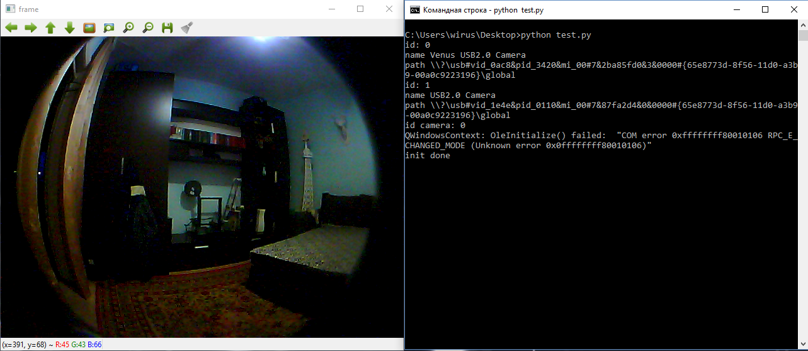

# List Capture Devices for Python OpenCV on Windows

OpenCV does not have an API for listing capture devices. The sample shows how to create a Python extension to invoke DirectShow C++ APIs for enumerating capture devices.

device.dll file compiled for 64 bit version

Creating DLL from CUDA using nvcc(or gcc)
```
nvcc -o device.dll --shared device.cpp
```

Run
```
python.exe test.py
Select and enter camera id
```


